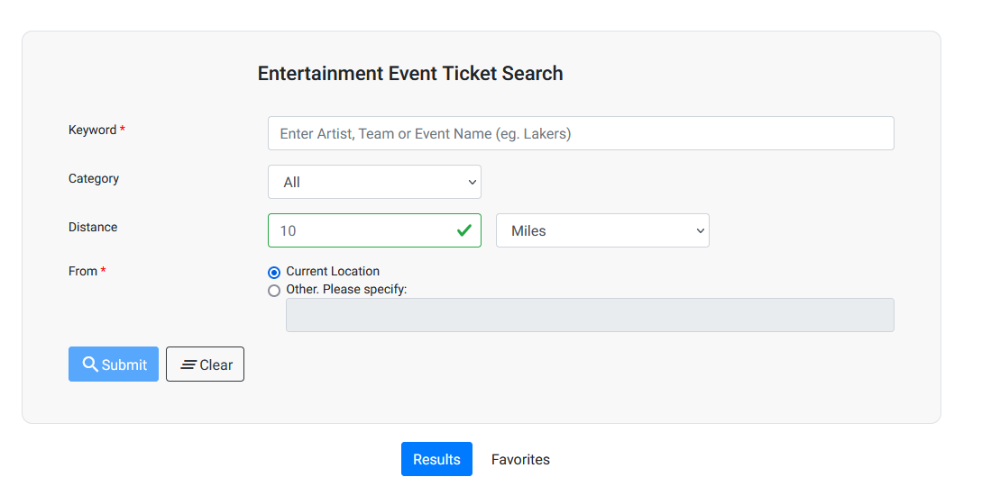
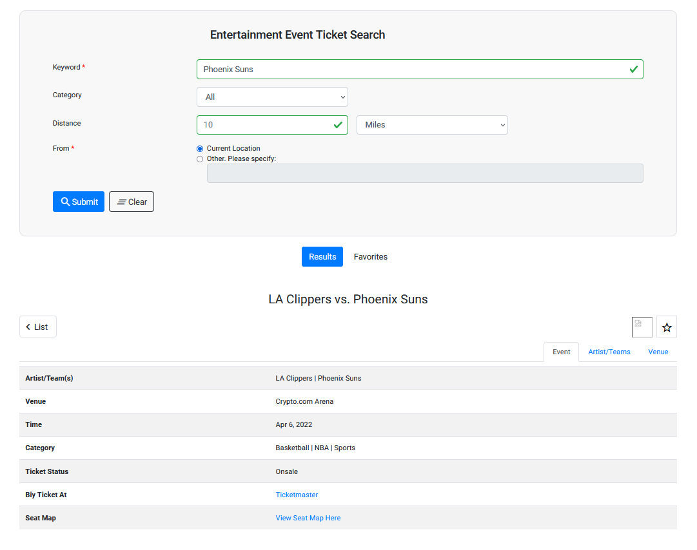

# Eventify-Angular
Website that shows the user all events in a given area and the capability to book tickets. Built using Angular 12 while utilizing Ticketmaster, Spotify, Google Maps, and Google Autocomplete APIs. The following images showcase the website in action. A live preview can be found  which is hosted on Google Cloud.

This was developed as part of my CSCI 571 (Web Technologies) course at USC Summer 2021.

